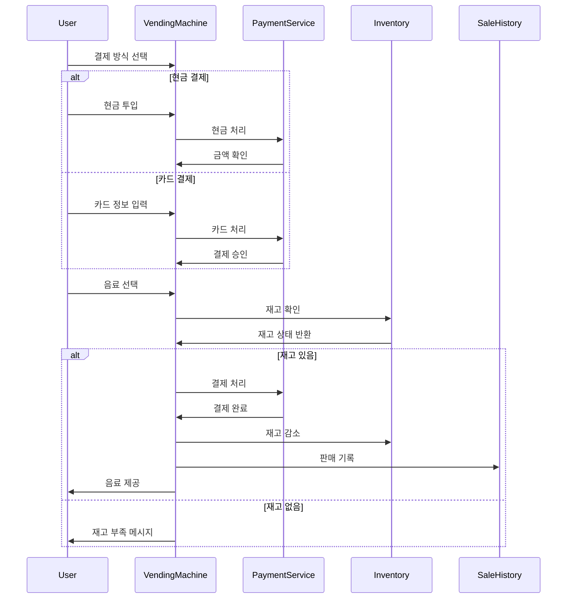

# 자판기 시스템 (Vending Machine System)

## 📋 프로젝트 개요
이 프로젝트는 자판기 시스템을 구현한 것으로, 사용자가 음료수를 구매할 수 있는 자동 판매 시스템입니다. 현금과 카드 두 가지 결제 방식을 지원하며, 재고 관리, 매출 통계, 결제 처리 등의 기능을 제공합니다.

## 🏗 시스템 아키텍처

### 주요 컴포넌트
- **VendingMachineService**: 자판기의 핵심 서비스
- **CashPaymentService**: 현금 결제 처리
- **CardPaymentService**: 카드 결제 처리
- **SaleHistoryService**: 판매 이력 관리
- **InventoryManager**: 재고 관리
- **StateManager**: 자판기 상태 관리

### 주요 모델
- **Beverage**: 음료 정보
- **PaymentMethod**: 결제 방식 (현금/카드)
- **Money**: 화폐 단위
- **SaleHistory**: 판매 이력
- **Inventory**: 재고 정보
- **State**: 자판기 상태

## 🔄 시스템 흐름



## 💡 주요 기능

### 1. 결제 처리
- **현금 결제**
  - 다양한 화폐 단위 지원 (1000원, 500원, 100원 등)
  - 거스름돈 계산 및 반환
  - 결제 취소 기능

- **카드 결제**
  - 카드 정보 검증
  - 결제 승인 처리
  - 결제 실패 처리

### 2. 재고 관리
- 음료 재고 확인
- 재고 부족 상황 처리
- 재고 충전 기능

### 3. 매출 관리
- 판매 이력 기록
- 매출 통계 제공
- 결제 방식별 매출 분석

## ⚠️ 예외 처리
1. **재고 부족**
   - 음료 재고가 없을 경우 구매 불가
   - 재고 부족 메시지 표시

2. **결제 실패**
   - 금액 부족
   - 카드 결제 실패
   - 결제 취소

3. **시스템 오류**
   - 결제 처리 실패
   - 재고 관리 오류
   - 데이터 저장 오류

## 🔮 확장성
1. **새로운 결제 방식 추가**
   - 모바일 결제
   - QR 코드 결제

2. **새로운 음료 추가**
   - 음료 정보 확장
   - 재고 관리 확장

3. **추가 기능**
   - 사용자 선호도 분석
   - 재고 자동 주문
   - 원격 모니터링

## 📁 프로젝트 구조
```
src/main/kotlin/
├── Main.kt
├── model/
│   ├── beverage/
│   ├── inventory/
│   ├── payment/
│   ├── sales/
│   └── state/
├── service/
│   ├── VendingMachineService.kt
│   ├── CashPaymentService.kt
│   ├── CardPaymentService.kt
│   └── SaleHistoryService.kt
└── util/
```

## 🚀 실행 방법
1. 프로젝트를 클론합니다.
2. Kotlin 환경을 설정합니다.
3. `Main.kt` 파일을 실행합니다.

## 📝 라이센스
이 프로젝트는 MIT 라이센스를 따릅니다. 