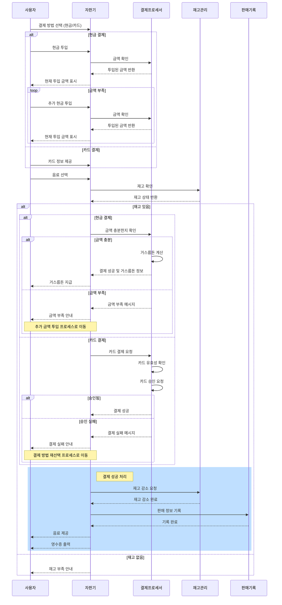
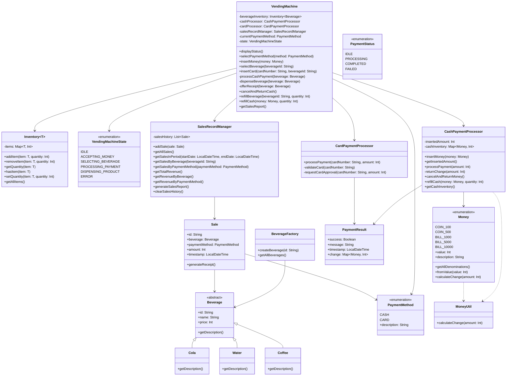
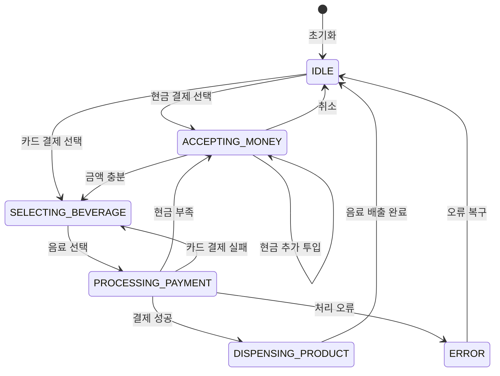

# 자판기 시스템 설계 문서

## 1. 개요
본 문서는 자판기 시스템의 동작 메커니즘을 설명하며, 사용자가 원하는 음료를 구매하기까지의 전체 프로세스를 다이어그램과 함께 제공합니다. 자판기 시스템은 객체지향 설계 원칙에 따라 구현되었으며, Kotlin 프로그래밍 언어를 사용했습니다.

## 2. 시스템 다이어그램
다음은 자판기 시스템의 작동 메커니즘을 보여주는 다이어그램입니다:

### 자판기 시스템 흐름도


### 자판기 시스템 클래스 다이어그램


### 자판기 상태 다이어그램


## 3. 시스템 컴포넌트 구성
자판기 시스템은 다음과 같은 주요 컴포넌트로 구성됩니다:

### 3.1 코어 컴포넌트
- **VendingMachine**: 자판기의 핵심 로직을 담당하는 메인 클래스입니다. 사용자 상호작용, 결제 처리, 상품 제공 등 전체 프로세스를 조정합니다.

### 3.2 모델 컴포넌트
- **Beverage**: 음료 상품을 나타내는 추상 클래스와 그 구현체(Cola, Water, Coffee)
- **Money**: 화폐 단위를 나타내는 열거형
- **PaymentMethod**: 결제 방식(현금, 카드)을 나타내는 열거형
- **PaymentStatus**: 결제 상태를 나타내는 열거형
- **VendingMachineState**: 자판기 상태를 나타내는 열거형
- **Sale**: 판매 기록을 나타내는 데이터 클래스

### 3.3 프로세서 컴포넌트
- **CashPaymentProcessor**: 현금 결제 처리를 담당
- **CardPaymentProcessor**: 카드 결제 처리를 담당

### 3.4 관리 컴포넌트
- **Inventory**: 재고 관리를 담당하는 제네릭 클래스
- **SalesRecordManager**: 판매 기록 관리 및 통계 제공

### 3.5 유틸리티 컴포넌트
- **BeverageFactory**: 음료 생성을 담당하는 팩토리 클래스
- **MoneyUtil**: 화폐 관련 유틸리티 함수를 제공하는 클래스

## 4. 시스템 동작 프로세스
자판기 시스템은 다음과 같은 주요 프로세스를 통해 동작합니다:

### 4.1 결제 방법 선택 프로세스
- 사용자가 결제 방법(현금/카드)을 선택합니다.
- 자판기는 선택된 결제 방법에 따라 상태를 변경합니다.
  - 현금 결제: ACCEPTING_MONEY 상태로 전환
  - 카드 결제: SELECTING_BEVERAGE 상태로 전환

### 4.2 현금 결제 프로세스
- 사용자가 현금을 투입합니다.
- 현금 유효성을 검사하고 총 투입 금액을 계산합니다.
- 현재 투입 금액을 사용자에게 표시합니다.
- 필요에 따라 추가 금액을 투입할 수 있습니다.

### 4.3 음료 선택 및 구매 프로세스
- 사용자가 원하는 음료를 선택합니다.
- 재고 상태를 확인합니다.
- 결제 방법에 따라 결제를 처리합니다:
  - 현금 결제: 투입 금액이 충분한지 확인하고, 거스름돈 계산
  - 카드 결제: 카드 유효성 확인 및 승인 요청
- 결제가 성공하면 음료를 제공하고, 실패하면 적절한 오류 메시지를 표시합니다.

### 4.4 음료 제공 프로세스
- 재고를 감소시킵니다.
- 판매 기록을 생성합니다.
- 음료를 배출합니다.
- 필요한 경우 영수증을 출력합니다.
- 자판기 상태를 IDLE로 전환합니다.

### 4.5 오류 처리 프로세스
- 재고 부족: 사용자에게 재고 부족 메시지 표시
- 금액 부족: 추가 금액 투입 요청
- 카드 결제 실패: 다른 결제 방법 선택 요청
- 기타 오류: 적절한 오류 메시지 표시 및 초기 상태로 복귀

## 5. 예외 상황 처리
자판기 시스템은 다음과 같은 예외 상황에 대한 처리 로직을 구현했습니다:

### 5.1 결제 관련 예외
- 현금 부족: 선택한 음료의 가격보다 투입 금액이 적은 경우, 부족한 금액을 표시하고 추가 금액 투입을 요청합니다.
- 거스름돈 부족: 투입 금액에 대한 거스름돈이 부족한 경우, 관리자 호출 메시지를 표시합니다.
- 유효하지 않은 화폐: 지원하지 않는 화폐 단위가 투입된 경우 오류 메시지를 표시하고 반환합니다.
- 카드 유효성 오류: 유효하지 않은 카드 번호인 경우, 오류 메시지를 표시합니다.
- 카드 승인 실패: 카드 결제 승인이 거부된 경우, 실패 메시지를 표시합니다.

### 5.2 재고 관련 예외
- 재고 부족: 선택한 음료의 재고가 없는 경우, 재고 부족 메시지를 표시합니다.
- 존재하지 않는 음료: 시스템에 등록되지 않은 음료 ID를 선택한 경우, 오류 메시지를 표시합니다.

### 5.3 취소 관련 예외
- 현금 결제 취소: 사용자가 현금 결제를 취소하는 경우, 투입된 금액을 반환합니다.
- 결제 방법 미선택 상태에서의 취소: 결제 방법이 선택되지 않은 상태에서 취소를 요청한 경우, 취소 불가 메시지를 표시합니다.

## 6. 확장성 및 유지보수성
자판기 시스템은 다음과 같은 설계 원칙을 통해 확장성과 유지보수성을 확보했습니다:

### 6.1 객체지향 설계
- 추상화: 음료를 추상 클래스로 정의하여 다양한 음료 유형을 쉽게 추가할 수 있습니다.
- 캡슐화: 각 컴포넌트는 내부 구현을 캡슐화하고 필요한 인터페이스만 외부에 노출합니다.
- 상속: 음료 클래스는 상속을 통해 공통 속성과 메서드를 재사용합니다.
- 다형성: 다양한 음료 유형과 결제 방식을 다형성을 통해 일관되게 처리합니다.

### 6.2 디자인 패턴 적용
- 팩토리 패턴: BeverageFactory를 통해 음료 객체 생성을 캡슐화합니다.
- 상태 패턴: 자판기의 상태 변화를 VendingMachineState 열거형으로 관리합니다.
- 전략 패턴: 다양한 결제 방식을 별도의 프로세서로 구현합니다.

### 6.3 모듈화 및 패키지 구조
- 기능별로 패키지를 구분하여 코드의 가독성과 유지보수성을 높였습니다.
- 각 클래스는 단일 책임 원칙(SRP)에 따라 하나의 책임에 집중합니다.

## 📁 프로젝트 구조
```
src/main/kotlin/
├── Main.kt
├── model/
│   ├── beverage/
│   ├── inventory/
│   ├── payment/
│   ├── sales/
│   └── state/
├── service/
│   ├── VendingMachineService.kt
│   ├── CashPaymentService.kt
│   ├── CardPaymentService.kt
│   └── SaleHistoryService.kt
└── util/
```

## 실행 방법
1. 프로젝트를 클론합니다.
2. Kotlin 환경을 설정합니다.
3. `Main.kt` 파일을 실행합니다.

## 📝 라이센스
이 프로젝트는 MIT 라이센스를 따릅니다. 