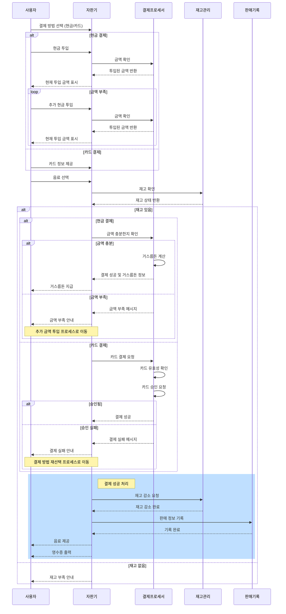
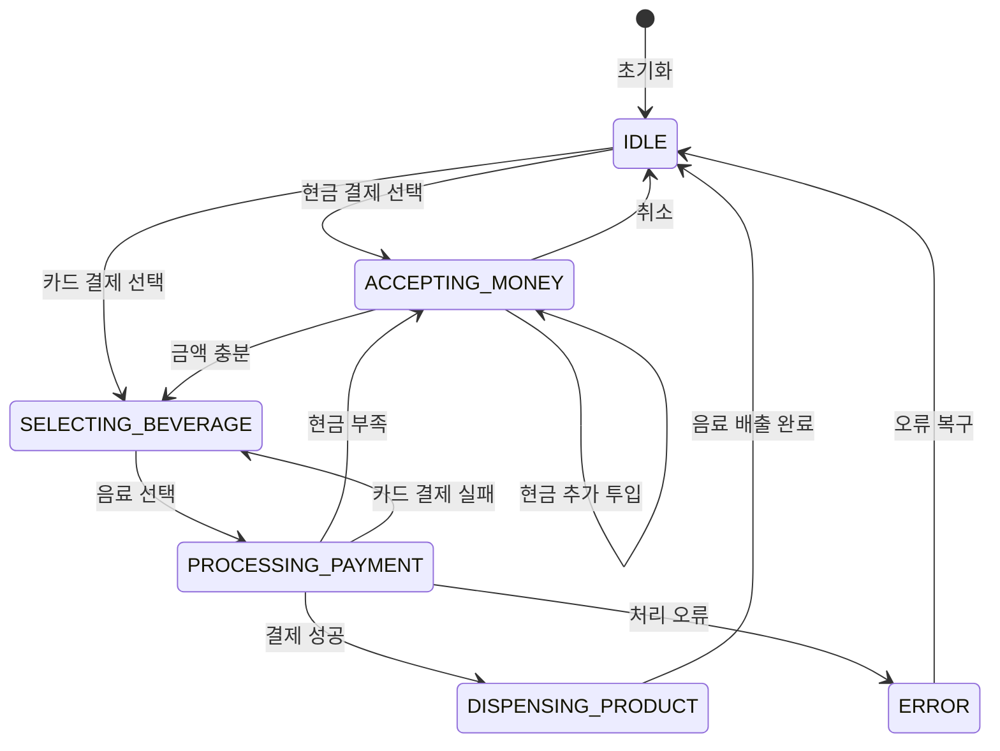

# 자판기 시스템 (Vending Machine System)

## 프로젝트 개요
이 프로젝트는 자판기 시스템을 구현한 것으로, 사용자가 음료수를 구매할 수 있는 자동 판매 시스템입니다. 현금과 카드 두 가지 결제 방식을 지원하며, 재고 관리, 매출 통계, 결제 처리 등의 기능을 제공합니다.

## 시스템 아키텍처

### 주요 컴포넌트
- **VendingMachineService**: 자판기의 핵심 서비스
- **CashPaymentService**: 현금 결제 처리
- **CardPaymentService**: 카드 결제 처리
- **SaleHistoryService**: 판매 이력 관리
- **InventoryManager**: 재고 관리
- **StateManager**: 자판기 상태 관리

### 주요 모델
- **Beverage**: 음료 정보
- **PaymentMethod**: 결제 방식 (현금/카드)
- **Money**: 화폐 단위
- **SaleHistory**: 판매 이력
- **Inventory**: 재고 정보
- **State**: 자판기 상태

## 시스템 흐름



## 시스템 구조

### 클래스 다이어그램


### 상태 다이어그램


## 클래스 구조

```mermaid
classDiagram
    class VendingMachine {
        -beverageInventory: Inventory~Beverage~
        -cashProcessor: CashPaymentProcessor
        -cardProcessor: CardPaymentProcessor
        -salesRecordManager: SalesRecordManager
        -currentPaymentMethod: PaymentMethod
        -state: VendingMachineState
        +displayStatus()
        +selectPaymentMethod(method: PaymentMethod)
        +insertMoney(money: Money)
        +selectBeverage(beverageId: String)
        +insertCard(cardNumber: String, beverageId: String)
        -processCashPayment(beverage: Beverage)
        -dispenseBeverage(beverage: Beverage)
        -offerReceipt(beverage: Beverage)
        +cancelAndReturnCash()
        +refillBeverage(beverageId: String, quantity: Int)
        +refillCash(money: Money, quantity: Int)
        +getSalesReport()
    }
    
    class Beverage {
        <<abstract>>
        +id: String
        +name: String
        +price: Int
        +getDescription()
    }
    
    class Cola {
        +getDescription()
    }
    
    class Water {
        +getDescription()
    }
    
    class Coffee {
        +getDescription()
    }
    
    class BeverageFactory {
        +createBeverage(id: String)
        +getAllBeverages()
    }
    
    class Inventory~T~ {
        -items: Map~T, Int~
        +addItem(item: T, quantity: Int)
        +removeItem(item: T, quantity: Int)
        +getQuantity(item: T)
        +hasItem(item: T)
        +setQuantity(item: T, quantity: Int)
        +getAllItems()
    }
    
    class Money {
        <<enumeration>>
        COIN_100
        COIN_500
        BILL_1000
        BILL_5000
        BILL_10000
        +value: Int
        +description: String
        +getAllDenominations()
        +fromValue(value: Int)
        +calculateChange(amount: Int)
    }
    
    class PaymentMethod {
        <<enumeration>>
        CASH
        CARD
        +description: String
    }
    
    class PaymentStatus {
        <<enumeration>>
        IDLE
        PROCESSING
        COMPLETED
        FAILED
    }
    
    class VendingMachineState {
        <<enumeration>>
        IDLE
        ACCEPTING_MONEY
        SELECTING_BEVERAGE
        PROCESSING_PAYMENT
        DISPENSING_PRODUCT
        ERROR
    }
    
    class PaymentResult {
        +success: Boolean
        +message: String
        +timestamp: LocalDateTime
        +change: Map~Money, Int~
    }
    
    class CashPaymentProcessor {
        -insertedAmount: Int
        -cashInventory: Map~Money, Int~
        +insertMoney(money: Money)
        +getInsertedAmount()
        +processPayment(amount: Int)
        -returnChange(amount: Int)
        +cancelAndReturnMoney()
        +refillCash(money: Money, quantity: Int)
        +getCashInventory()
    }
    
    class CardPaymentProcessor {
        +processPayment(cardNumber: String, amount: Int)
        -validateCard(cardNumber: String)
        -requestCardApproval(cardNumber: String, amount: Int)
    }
    
    class Sale {
        +id: String
        +beverage: Beverage
        +paymentMethod: PaymentMethod
        +amount: Int
        +timestamp: LocalDateTime
        +generateReceipt()
    }
    
    class SalesRecordManager {
        -salesHistory: List~Sale~
        +addSale(sale: Sale)
        +getAllSales()
        +getSalesInPeriod(startDate: LocalDateTime, endDate: LocalDateTime)
        +getSalesByBeverage(beverageId: String)
        +getSalesByPaymentMethod(paymentMethod: PaymentMethod)
        +getTotalRevenue()
        +getRevenueByBeverage()
        +getRevenueByPaymentMethod()
        +generateSalesReport()
        +clearSalesHistory()
    }
    
    class MoneyUtil {
        +calculateChange(amount: Int)
    }
    
    Beverage <|-- Cola
    Beverage <|-- Water
    Beverage <|-- Coffee
    
    VendingMachine --> Inventory
    VendingMachine --> CashPaymentProcessor
    VendingMachine --> CardPaymentProcessor
    VendingMachine --> SalesRecordManager
    VendingMachine --> VendingMachineState
    VendingMachine --> PaymentMethod
    
    BeverageFactory --> Beverage
    
    SalesRecordManager --> Sale
    
    Sale --> Beverage
    Sale --> PaymentMethod
    
    CashPaymentProcessor --> Money
    CashPaymentProcessor --> PaymentResult
    CashPaymentProcessor ..> MoneyUtil
    
    CardPaymentProcessor --> PaymentResult
    
### 1. 결제 처리
- **현금 결제**
  - 다양한 화폐 단위 지원 (1000원, 500원, 100원 등)
  - 거스름돈 계산 및 반환
  - 결제 취소 기능

- **카드 결제**
  - 카드 정보 검증
  - 결제 승인 처리
  - 결제 실패 처리

### 2. 재고 관리
- 음료 재고 확인
- 재고 부족 상황 처리
- 재고 충전 기능

### 3. 매출 관리
- 판매 이력 기록
- 매출 통계 제공
- 결제 방식별 매출 분석

## 예외 처리
1. **재고 부족**
   - 음료 재고가 없을 경우 구매 불가
   - 재고 부족 메시지 표시

2. **결제 실패**
   - 금액 부족
   - 카드 결제 실패
   - 결제 취소

3. **시스템 오류**
   - 결제 처리 실패
   - 재고 관리 오류
   - 데이터 저장 오류

## 확장성
1. **새로운 결제 방식 추가**
   - 모바일 결제
   - QR 코드 결제

2. **새로운 음료 추가**
   - 음료 정보 확장
   - 재고 관리 확장

3. **추가 기능**
   - 사용자 선호도 분석
   - 재고 자동 주문
   - 원격 모니터링

## 📁 프로젝트 구조
```
src/main/kotlin/
├── Main.kt
├── model/
│   ├── beverage/
│   ├── inventory/
│   ├── payment/
│   ├── sales/
│   └── state/
├── service/
│   ├── VendingMachineService.kt
│   ├── CashPaymentService.kt
│   ├── CardPaymentService.kt
│   └── SaleHistoryService.kt
└── util/
```

## 실행 방법
1. 프로젝트를 클론합니다.
2. Kotlin 환경을 설정합니다.
3. `Main.kt` 파일을 실행합니다.

## 📝 라이센스
이 프로젝트는 MIT 라이센스를 따릅니다. 